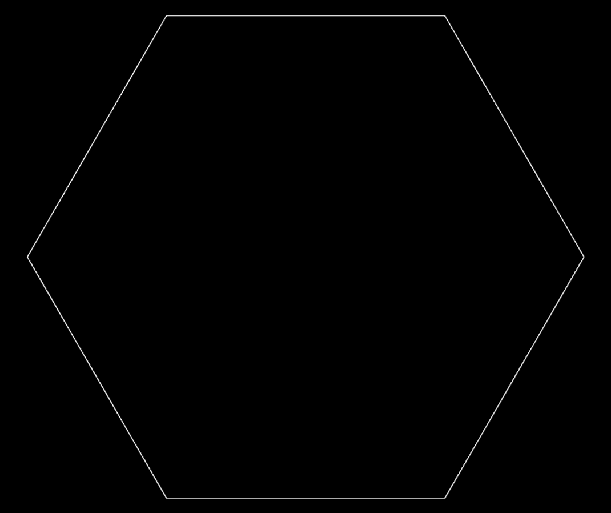

# Colorful.js

This project defines a hexagonal grid which acts as a color-mixing sandbox through wave propagation.

---

# Try it!
The [github pages deployment](phantom22.github.io/colorful.js/) works flawlessly on chromium-based browsers but, depending on your hardware and OS, can have some issues on firefox forks. If you are interested in playing around with the sandbox, cloning locally the project gives the best experience compatibility-wise.